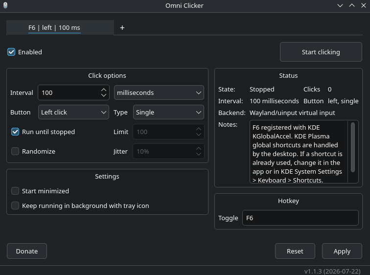

# omniclicker

A native Linux autoclicker with support for X11 and modern Wayland desktops.

omniclicker aims to provide a simple, clean, and intuitive autoclicking experience while supporting desktop environments where many other autoclickers don't work.



## Why omniclicker?

Many Linux autoclickers only support X11 or require manual setup for specific Wayland compositors.

OmniClicker is designed to work out of the box. It automatically uses the most appropriate backend for your desktop environment, providing native support for X11, KDE Plasma, GNOME, Sway, and Hyprland through desktop-specific integrations where available.

The goal is simple: install it, choose your settings, and start clicking.
## Features

* Native Linux application written in C++
* Supports X11
* Supports Wayland:
    * KDE Plasma
    * GNOME
    * Sway
    * Hyprland
* Configurable click interval + randomization(optional)
* Left, right and scroll wheel mouse click support + custom keys 
* Global shortcut/hotkey support
* Run in background support
* Multiple clicking profiles
* Clean and simple Qt6 interface
* No Electron or web technologies

## Installation

### Build from source

#### Dependencies

You need:

* CMake
* A C++17 compiler
* Qt 6
* X11 libraries
* libXtst

On **Debian / Ubuntu** based distributions:

```bash
sudo apt install cmake build-essential qt6-base-dev libx11-dev libxtst-dev
```

On **Arch**:

```bash
sudo pacman -S cmake gcc qt6-base libx11 libxtst
```

Optional KDE Plasma support:

```bash
sudo pacman -S kglobalaccel
```

On **Fedora**:

```bash
sudo dnf install cmake gcc-c++ qt6-qtbase-devel libX11-devel libXtst-devel
```

### Build

Clone the repository:

```bash
git clone https://github.com/limonyx/omniclicker.git
cd omniclicker
```

Configure and build:

```bash
cmake -B build -DCMAKE_INSTALL_PREFIX="$HOME/.local"
cmake --build build
```

### Install

```bash
cmake --install build
```

## Contributing

Contributions, bug reports, and suggestions are welcome.

If omniclicker doesn't work correctly on your desktop environment, please open an issue and include:

* Your desktop environment/compositor
* Your session type (X11 or Wayland)
* Any error messages

## License

omniclicker is licensed under the GNU General Public License v3.0 or later.

